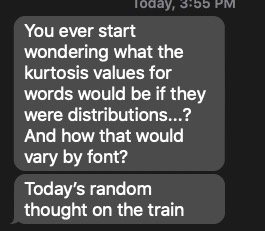
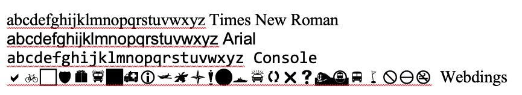

You ever have a random text that sent your brain to work? Here's mine today:

```{r echo = F, fig.align = 'center', results = 'asis'}

```

Followed up with examples that lol is bimodal, while loop is positively skewed, and enter is "almost normal". The lovely K.D. posed this question to me earlier, and I already have procrastinated a lot today, so here's to more! First, I typed out some fonts in Word to help me figure out how to code the two important parts for this question: width and height. Webdings specifically by request. We have one serif font, one sans serif font, and one monospaced font.

```{r echo = F, fig.align = 'center', results = 'asis'}

```

I don't have a perfect representation of this numerically, but for this analysis, we are going to compare everything to the letter a. Therefore, a is coded as a 1 for width and a 1 for height. For skinnier letters, like f, i, j, and l, they get a .5 for width. The letters m and w received 1.5 for serif and sans serif fonts for being wider than the rest. A mono spaced font like `console` received all 1s for width. Very strangely, the only skinny letter in Webdings is the letter m for the little man character. For height purposes, all readable fonts are the same, tall letters got a 2 for being tall. They don't quite actually take up 2 height wise, but for the math here, 2 is a bit easier to work with.

```{r echo = T}
font_size <- read.csv("font_sizes.csv", stringsAsFactors = F)
head(font_size)
```

Let's take the word enter for a second in a sans or serif font (they were the same honestly wide and tall wise). To create a distribution for enter, we are going to do the following:

- e = 1 for the first letter * 1 for width = 1 repeated 1 for height
- n = 1 for e + 1 for width = 2 repeated 1 for height
- t = 1 for e + 1 for n + .5 for width = 2.5 repeated 2 for height
- e = 1 for e + 1 for n + .5 for t + 1 for width = 3.5 repeated 1 for height
- r = 1 for e + 1 for n + .5 for t + 1 for e + .5 for width = 4 repeated 1 for height

```{r echo = T}
enter <- c(1, 2, 2.5, 2.5, 3.5, 4)
hist(enter, breaks = 5)
```

Again, not a perfect representation, but should do. Then we can calculate skew and kurtosis on the word:

```{r echo = T}
library(moments)
skewness(enter)
kurtosis(enter)
```

So, almost no skew, and some kurtosis, but cut the word some slack with such a small sample size ;). In the Webdings font, this word would be perfectly uniform, as each character takes up the same height and space, since there's no letter m. 

```{r echo = T}
enter2 <- c(1,2,3,4,5)
skewness(enter2)
kurtosis(enter2)
```

We will apply this algorithm to the English Lexicon Project with some caveats to only pick words with at least three letters, who are mostly real parts of speech, excluding some NULL values in the ELP data. 

```{r}
elp <- read.csv("elp_small.csv")
elp$word <- gsub("'", "", elp$word) #remove '
elp <- elp[!duplicated(elp$word) , ] #remove duplicates
elp$word <- tolower(elp$word) #lower case
elp$length <- nchar(elp$word) #recalculate length without '

elp <- subset(elp, 
              pos != "NULL" & length >= 3)

nrow(elp)
```

Now, we can create a function to calculate the skew and kurtosis for each word:

```{r eval = F}
library(plyr)

final_stuff <- matrix(NA, nrow = length(elp$word), ncol = 7)
colnames(final_stuff) <- c("word", "s_sans", "s_mono", "s_webdings", 
                           "k_sans", "k_mono", "k_webdings")
final_stuff <- as.data.frame(final_stuff)

for (i in 1:length(elp$word)){
  
  letters <- unlist(strsplit(elp$word[i], ""))
  
  numbers_sans <- cumsum(as.numeric(suppressMessages(mapvalues(letters, font_size$letter, font_size$sans_serif))))
  numbers_mono <- cumsum(as.numeric(suppressMessages(mapvalues(letters, font_size$letter, font_size$mono))))
  numbers_webdings <- cumsum(as.numeric(suppressMessages(mapvalues(letters, font_size$letter, font_size$webdings))))
  
  repeating <- as.numeric(mapvalues(letters, font_size$letter, font_size$height))
  
  distribution_sans <- rep(numbers_sans, repeating)
  distribution_mono <- rep(numbers_mono, repeating)
  distribution_webdings <- rep(numbers_webdings, repeating)
  
  final_stuff$word[i] <- elp$word[i]
  final_stuff$s_sans[i] <- skewness(distribution_sans)
  final_stuff$s_mono[i] <- skewness(distribution_mono)
  final_stuff$s_webdings[i] <- skewness(distribution_webdings)
  final_stuff$k_sans[i] <- kurtosis(distribution_sans)
  final_stuff$k_mono[i] <- kurtosis(distribution_mono)
  final_stuff$k_webdings[i] <- kurtosis(distribution_webdings)
    
}

write.csv(final_stuff, "final_distribution.csv", row.names = F)
```

```{r echo = F}
final_stuff <- read.csv("final_distribution.csv", stringsAsFactors = F)
```

Let's see what happened! You should take all these results with a small grain of salt, given that the average length of words is `r round(mean(elp$length), 2)`. To better interpret the kurtosis plots, you should know that uniform distributions are ~ 1.76 kurtosis, while normal distributions have a kurtosis of around 3.

```{r}
kurtosis(c(1,2,4,5,6,7,8))
kurtosis(c(1,2,3,3,3,3,3,4,5))
```

```{r}
mean(final_stuff$s_sans)
hist(final_stuff$s_sans)
mean(final_stuff$k_sans)
hist(final_stuff$k_sans)
```

Most serif and sans serif fonts are *not* skewed, implying that tall letters are a bit more likely in the middle (or none at all).  We find that most sans or serif fonts are uniform in distribution. I think it would be hard for them to be much different than that because the highest point is 2 frequency wise.

```{r}
mean(final_stuff$s_mono)
hist(final_stuff$s_mono)
mean(final_stuff$k_mono)
hist(final_stuff$k_mono)
```

Monospace fonts are nearly all non-skewed (because all the letters take up the same space), and we've seen above that tall letters are likely not driving skew by only being on the ends of words. They are also more heavily uniform in kurtosis. 

```{r}
mean(final_stuff$s_webdings)
hist(final_stuff$s_webdings)
mean(final_stuff$k_webdings)
hist(final_stuff$k_webdings)
```

Webdings just makes me laugh, as there's only the letter m to drive any type of effect, so we see nearly no skew and a very uniform distribution for kurtosis. Some of the lowest kurtosis values are for `mimi` and what would be bimodal words: `brat, drat, fret, trot` while the highest values are for words that would be the most normal, especially words with double `ll`: `billow, william, pillow`. 
So, English is uniform and mostly not skewed. You can find all the data at LINK.